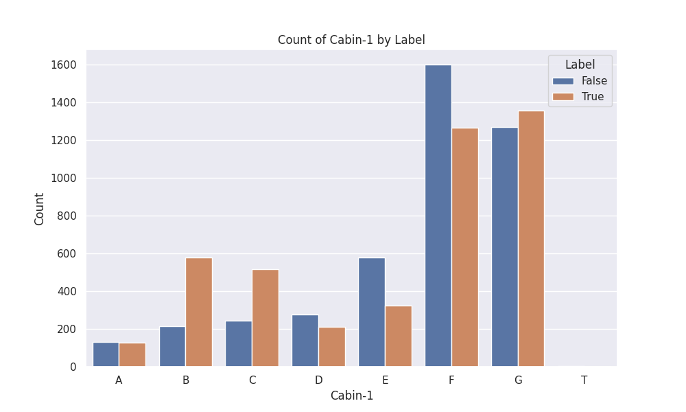
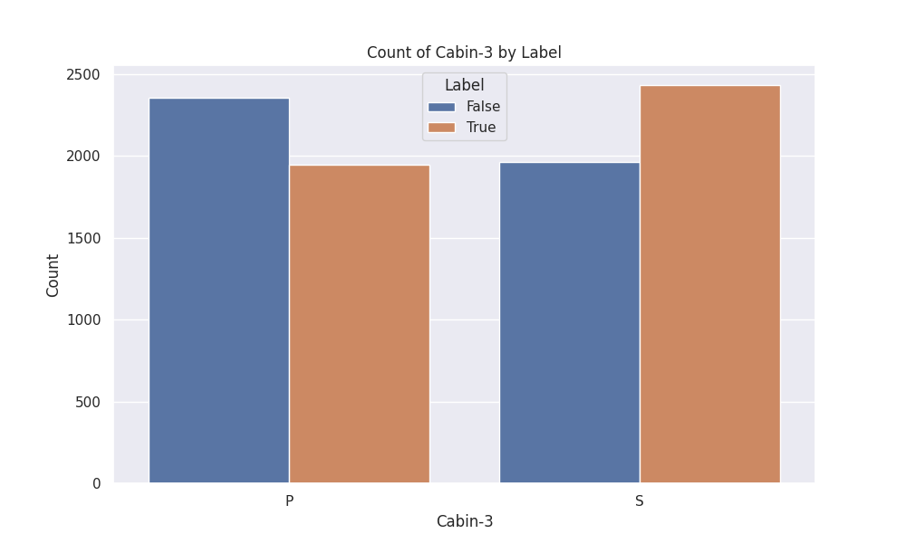
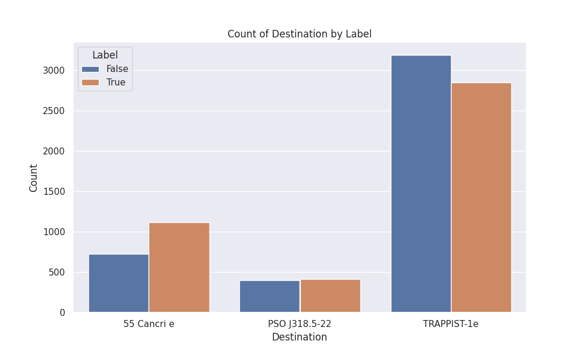
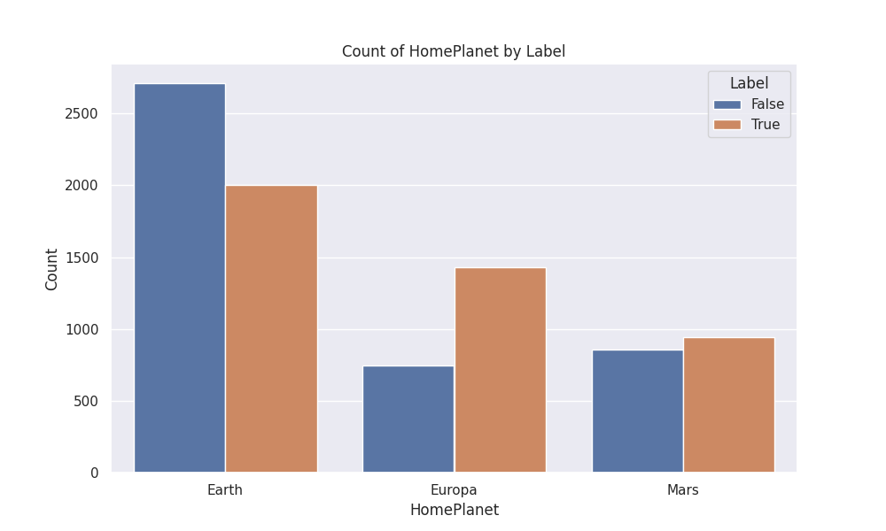

# kaggle-spaceship-titanic
Spaceship Titanic Kaggle competition

----------------------------------------------------
1. Place `train.csv`, `test.csv` to data
2. Run `python3 run-csv-process.py` to generate CSV splitting cabin, passenger info and filling in missing labels for the test set
3. 

----------------------------------------------------

Exploratory Data Analysis

* Total number of feature vectors in the training set `8693`, test set `4277`
* Column names excluding ID, surname/name: 
'HomePlanet', 'CryoSleep', 'Cabin-1', 'Cabin-2', 'Cabin-3', 'Destination', 'Age', 'VIP', 'RoomService', 'FoodCourt', 'ShoppingMall', 'Spa', 'VRDeck', 'Transported'
* NAN values are handled as distribution for Cabin-1, Cabin-3, Destination, Home planet, Age, for other non-categorical features
the NAN value is set to zero

| Feature name   | Chart (training )                        |
|----------------|------------------------------------------|
| Cabin-1 (deck) |      |
| Cabin-3 (type) |      |
| Destination    |  |
| Home planet    |   |

| Method | Result |
|------------|----------|
| Random forest | 0.77063 |
| 